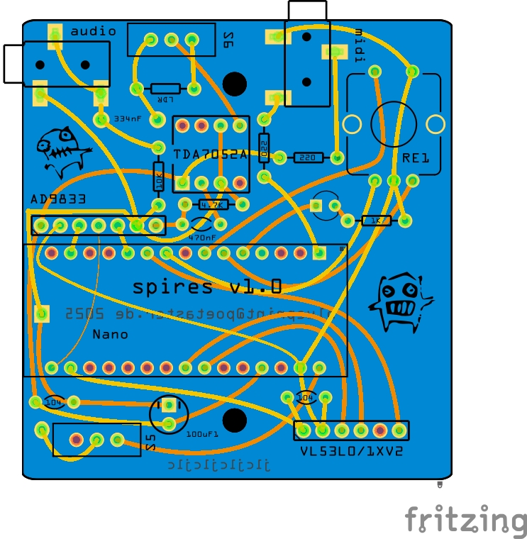
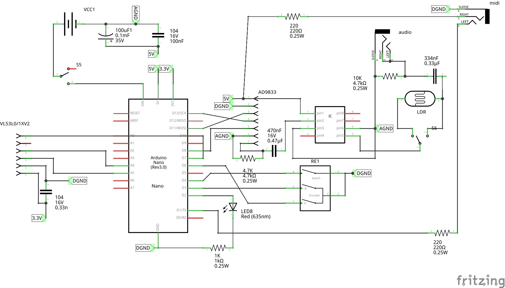

# spires
Spires is an arpeggiating synth using time of flight sensors to drive one or more digital oscillators. The processor used is either and arduino nano or and LGTBF328P.

Tremello is implemented with a simple LDR. 

