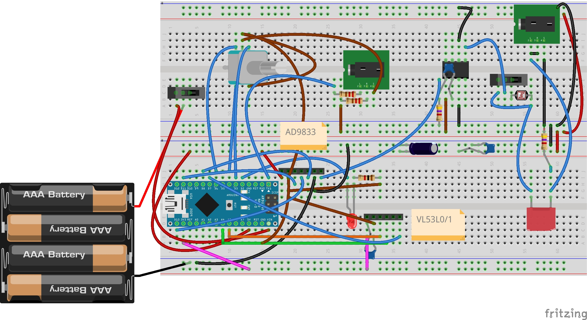

# spires
Spires is an arpeggiating synth using time of flight sensors to drive one or more digital oscillators. The processor used is either and arduino nano or and LGTBF328P.

Tremello is implemented with a simple LDR. 

## Modes

The default program reproduces the modes. Holding the encoder button depressed and turning choses a mode, in the traditional order Ionian, Dorian, Phrygian, Lydian, Mixolodian, Aeolian, Locrian. Pressing the encoder button in this program changes the root, from C to B. So you can play all the modes in any key.

The remaining programs are composed to selected scales.  The programs:
1. ragas
2. various historical europeans
3. some more exotics (geographical as well as cultural)
4. pentatonics from diverse cultures
5. hexatonics 

In all a bunch of scale material :)

